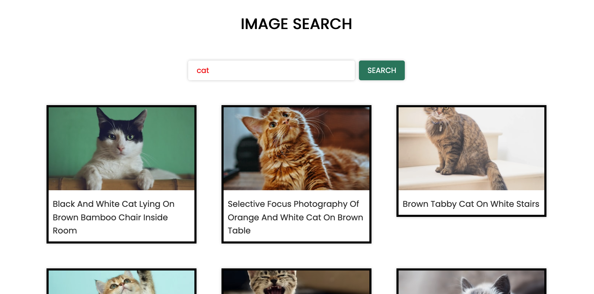

# Photo Search App

A simple web application that allows users to search for images using an external API.

## Features

- Search for photos by keyword
- Display search results in a responsive grid
- Clean and simple user interface

## Technologies Used

- HTML
- CSS
- JavaScript
- Unsplash.com API

## Getting Started

### Prerequisites

- A modern web browser (Chrome, Firefox, Safari, etc.)
- A code editor with Live Server extension (recommended: VS Code)

## API Setup

This project requires an API key:
1. Sign up at [Unsplash.com](https://unsplash.com/join) and confirm your account by email.

2. Get your API key
    - 2.1 Log in to unsplash.com
    - 2.2 Go to the menu, the small button in the lower right
    - 2.3 Go to Developers / API
    - 2.4 Click the black button "Your Apps"
    - 2.5 Click New Application
    - 2.6 Accept the Terms & Conditions
    - 2.7 Give your application a name and description
    - 2.8 At the bottom of the App page, there is an Access Key. Copy this to the clipboard

3. Add this Access Key between the quotations on the second line of code in script.js.

### Installation

1. Clone the repository:
```bash
git clone https://github.com/ridley88/JSbasic_Image_App.git
```

2. Navigate to the project directory:
```bash
cd Jsbasic_Image_App
```
3. Open `index.html` with Live Server in VS Code, or simply open the file in your browser.

## Usage

1. Enter a search term in the input field
2. Click the search button
3. Browse through the returned image results

## Screenshots



## Future Improvements

- Add pagination for search results
- Implement loading indicators
- Add error handling for failed API requests

## License

This project is open source and available under the [MIT License](LICENSE).

## Contact

Nick Murry - nickmurry@gmail.com

Project Link: [https://github.com/ridley88/JSbasic_Image_App.git]